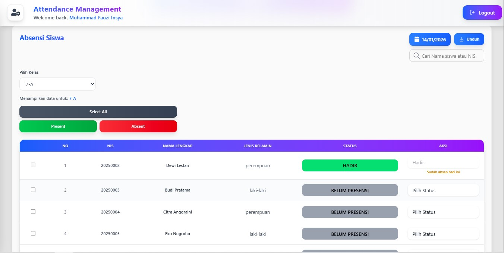

# Sistem Absensi Guru dan Murid

## Deskripsi Proyek

Sistem Absensi Guru dan Murid adalah aplikasi berbasis web yang digunakan untuk mencatat, mengelola, dan memantau kehadiran guru serta murid secara terstruktur dan real-time. Sistem ini dilengkapi dengan **Panel Admin** untuk manajemen data pengguna, kelas, jadwal, dan laporan absensi.

## Tujuan

- Meningkatkan efisiensi pencatatan absensi
- Mengurangi kesalahan pencatatan manual
- Menyediakan laporan absensi yang akurat dan terpusat
- Memudahkan monitoring kehadiran oleh admin dan pihak sekolah

## Role Pengguna

### 1. Admin

- Mengelola data guru dan murid
- Mengelola kelas dan jadwal
- Melihat dan mengekspor laporan absensi
- Mengelola akun dan hak akses

### 2. Guru

- Melakukan absensi kehadiran murid
- Melihat riwayat absensi kelas
- Mengelola data absensi sesuai jadwal mengajar

## Fitur Utama

- Autentikasi Login (Admin, Guru)
- Fitur cek history absensi
- Absensi harian berbasis waktu
- Panel Admin terpusat
- Rekap dan laporan absensi
- Manajemen data pengguna
- Antarmuka responsif

## Teknologi yang Digunakan

- Frontend : VITE React js
- Backend : Node.js
- Database : MySQL
- Tools : Git, GitHub

## Preview Aplikasi

### Halaman Login

### Dashboard Admin

### Page Data Guru

### Page Data Absen Guru

### Home Page

### Absensi Guru

### Absensi Murid

